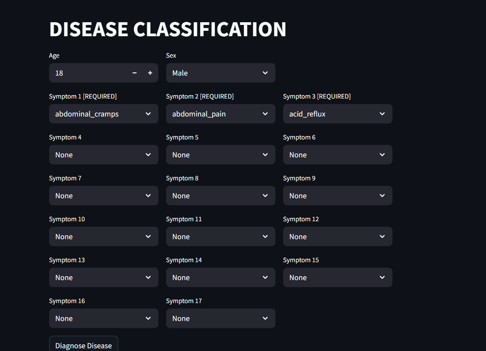
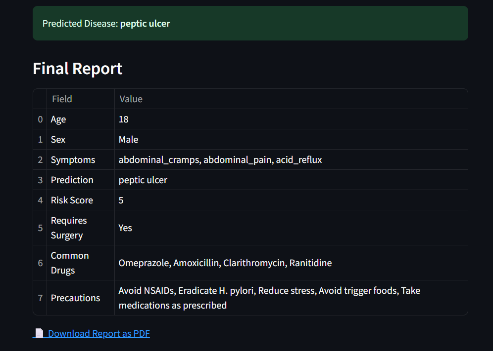

# DISEASES-CLASSIFICATION-AND-PRESCRIPTION-GENERATOR 

# 🩺 Disease Classification and Prescription Generator

A machine learning-based application that classifies diseases based on symptoms and generates relevant prescriptions, including recommended drugs, precautions, and dietary advice.  
Deployed using **Streamlit** 👉 [Click here to use the app](https://diseases-classification-and-prescription-generator.streamlit.app)

---

## 🖼️ Preview of the App

---

## 🎯 Purpose

This application is designed to assist users in identifying potential diseases based on their symptoms and provide basic medical guidance. The system classifies the disease and then outputs:

- Disease name
- Suggested prescription
- Recommended precautions
- Commonly used medicines and drugs
- Dietary advice (what to eat and avoid)

It is especially useful in scenarios where quick guidance is needed before visiting a doctor.

---

## 🧠 Problems It Can Solve

- Helps people identify likely illnesses from symptoms  
- Provides preliminary advice on treatment  
- Reduces dependency on unreliable online searches  
- Can be used in remote or under-resourced areas for quick triage

---

## 🧬 Diseases It Can Predict (48 total)

Examples include:
- Fungal Infection
- Acne Vulgaris
- Pneumonia
- Myocardial Infarction
- Hypothyroidism
- Rheumatoid Arthritis
- Lung Cancer
- HIV/AIDS
- Type 2 Diabetes
- Dengue Fever  
...and 38 more

Each disease has **200 sample records** used for training.

---

## 📦 Dataset Details

- Data was **manually collected from WHO and other reliable health websites**.
- Contains 48 disease classes, each with 200 samples.
- Each record includes:
  - List of symptoms
  - Corresponding disease
  - Prescription, precautions, medicines, and diet

---

## ⚙️ Feature Engineering & Preprocessing

From the code provided:
- **Symptom data** was **vectorized using `CountVectorizer()`** from scikit-learn.
- The text features were extracted from a string of symptoms and converted to numerical feature vectors.
- No missing value imputation or label encoding was required as data was preprocessed manually.

---

## 🤖 Model Details

- **Best Model Used:** `Bernoulli Naive Bayes`  
- **Accuracy:** 96.76%  
- **Evaluation Metric:** `accuracy_score` from scikit-learn
- **Other Tried Models:** `MultinomialNB`, `XGBClassifier` (but `BernoulliNB` gave the best performance)

---

## 🌐 Web App Details

- Built using **Streamlit**
- Hosted on **Streamlit Cloud**
- UI allows users to:
  - Enter symptoms
  - Get disease prediction
  - View full prescription, drugs, precautions, and diet recommendations

🔗 **Try the app here**:  
👉 https://diseases-classification-and-prescription-generator.streamlit.app

---

## 🚫 Limitations and Future Work

**Limitations:**
- Not a replacement for professional medical advice
- Accuracy may degrade on unseen symptoms or rare diseases
- Prescription info is basic and not personalized

**Future Work:**
- Include multilingual support
- Improve UI/UX design
- Add more symptoms and diseases
- Incorporate feedback loop for improving predictions
- Use LLMs or transformer models for better text understanding

---

## 📁 Folder Structure

